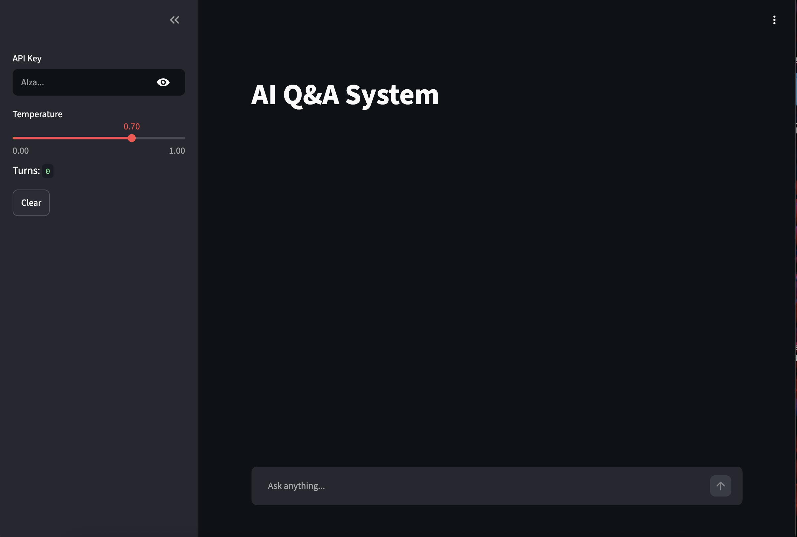

#  AI Powered Q&A System

A conversational AI application built with **LangChain**, **Google Gemini**, and **Streamlit** that demonstrates the core building blocks of modern LLM applications, including prompt templates, chains, and conversational memory.

---

## Overview

This project was developed as part of **Phase 2: Introduction to LangChain & Its Core Components** within the **LLM Foundation Playground** learning roadmap.

The application allows users to ask questions through a web interface and receive AI-generated responses while maintaining conversational context using LangChain Memory.

---

##  Features

* Conversational AI interface
* Powered by Google Gemini
* LangChain prompt templates
* Context-aware conversations using memory
* Adjustable temperature control
* Interactive Streamlit dashboard
* Real-time response generation
* Clean and responsive UI

---

## Architecture

```text
User Question
      │
      ▼
Prompt Template
      │
      ▼
LangChain Chain
      │
      ▼
Gemini LLM
      │
      ▼
Generated Response
      │
      ▼
Conversation Memory
      │
      ▼
Streamlit Interface
```

---

## LangChain Concepts Demonstrated

### LLM Integration

Connected LangChain with Google's Gemini model to generate natural language responses.

### Prompt Engineering

Implemented dynamic prompt templates for structuring user requests before sending them to the model.

### Chains

Used LangChain Chains to connect prompts and language models into a reusable workflow.

### Memory

Implemented ConversationBufferMemory to preserve conversation history and generate context-aware responses.

---

##  Tech Stack

| Technology               | Purpose                   |
| ------------------------ | ------------------------- |
| Python                   | Core programming language |
| LangChain                | LLM application framework |
| Google Gemini API        | Large Language Model      |
| Streamlit                | Web application interface |
| ConversationBufferMemory | Chat memory               |

---

##  Application Preview

### AI Powered Q&A Dashboard

## 📸 Application Preview



*Streamlit-based AI Powered Q&A System with LangChain Memory and Gemini Integration.*

*Interactive Streamlit dashboard with Gemini-powered conversational AI and memory support.*

---


##  Running the Application

```bash
streamlit run app.py
```

The application will launch in your browser and allow you to interact with the AI assistant.

---

##  Learning Outcomes

This project helped reinforce the following concepts:

* Understanding LangChain architecture
* Integrating external LLMs with LangChain
* Designing prompt templates
* Building chains for AI workflows
* Managing conversational memory
* Developing AI-powered web applications with Streamlit

---


##  Conclusion

This project demonstrates how LangChain simplifies the development of LLM-powered applications by combining prompts, chains, memory, and language models into a unified workflow. The resulting AI-powered Q&A system provides contextual and interactive conversations through a user-friendly web interface.
