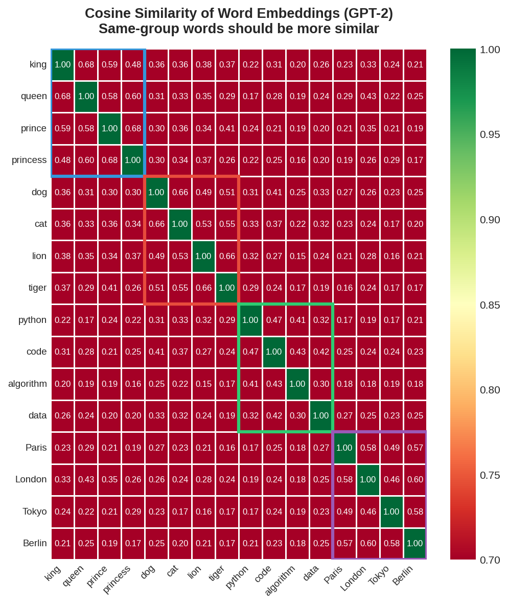
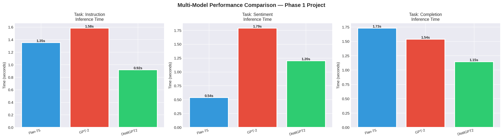

# 🔹 Phase 1: Foundations of Large Language Models (LLMs)

This directory contains the foundational evaluation playground designed to analyze the behavioral, mathematical, and architectural boundaries of localized open-source transformers (`Flan-T5-Base`, `GPT-2 Base`, and `DistilGPT2`) orchestrated via raw Hugging Face pipelines.

---

## 🛠️ Core Technical Implementations

### 1. Multilingual Tokenizer Profiling
* **Objective:** Map structural variations across tokenization algorithms including Byte-Pair Encoding (BPE), WordPiece, and SentencePiece.
* **Implementation:** Evaluated token splitting metrics against mixed Western and non-Latin scripts to analyze vocabulary fragmentation and sequence dilation.

### 2. Isotropic Embedding Space Transformation
* **Objective:** Extract and analyze semantic text vectors across localized domain groups (Royalty, Places, Animals, Tech).
* **Optimization:** Exposed the limits of *Embedding Anisotropy* where raw causal models compress hidden vectors into a hyper-narrow cone. Migrated the framework to a contrastively trained Bi-Encoder (`all-MiniLM-L6-v2`) to achieve a clean, well-distributed isotropic vector space.

### 3. Native Sliding-Window State Machine
* **Objective:** Simulate conversational context persistence.
* **Implementation:** Developed a custom `MemoryChatbot` wrapper that dynamically pools multi-turn conversations into a moving window.

---

## 📊 Empirical Analysis Dashboards

### 1. High-Contrast Semantic Similarity Heatmap
By replacing raw causal hidden state pooling with an optimized Bi-Encoder network, the word embeddings spread uniformly across the vector space. The heatmap reveals a distinct block-diagonal pattern, isolating conceptual clusters.



### 2. Multi-Model Inference Benchmark
An evaluation of prompt styling (Zero-Shot vs. Few-Shot) tracking execution latencies:



---

## ⚙️ How to Execute the Code
Ensure your environment is active, then open the Jupyter workspace:
```bash
pip install transformers torch sentence-transformers seaborn matplotlib scikit-learn
jupyter notebook Phase1_LLM_Foundations_LangChain_PROJECT.ipynb